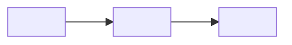

<!--
  README TEMPLATE. Read this block, then delete it.

  This template covers Tier 1, Tier 2, and Tier 3 sections in one file.
  It is not meant to be used as-is: pick a tier per docs/readme-standard.md,
  then delete every section marked for a tier you're not using. Tier 1
  sections are always required. Tier 2 sections are marked "Tier 2+ only".
  Tier 3 sections are marked "Tier 3 only".

  Every <angle-bracket> placeholder should be replaced with real content.
  Every HTML comment (including this one) should be deleted once the
  section it explains has been filled in or removed. A shipped README
  should have no comments left in it.

  Full guidance: ../docs/readme-standard.md
-->

# <project-name>

<!--
  TIER 1+ REQUIRED. Description paragraph.
  Two to four sentences of PROSE (not a table, not bullets). Answer:
  - What is this?
  - Why does it exist / what does it replace or avoid?
  Setup instructions never come before this paragraph.
-->
<one- to two-sentence description of what the project is and why it exists,
in plain language a first-time reader can absorb in ten seconds>

<!--
  Optional at any tier, but cheap and useful: a short explicit list of
  what the project deliberately does NOT do. Prevents readers evaluating
  it against the wrong use case, and prevents an agent from "fixing" a
  deliberate omission. Delete if there's nothing worth excluding.
-->
It does **not**:

- <thing it deliberately does not do>
- <another deliberate non-goal>

<!--
  Tier 2+ only: badge row.
  Only include badges that are TRUE, CURRENT, and MEANINGFUL. See
  docs/readme-standard.md#badges. Worth it: CI status, license, latest
  release, platform support. Not worth it below Tier 3: a row of
  language/framework badges that just restates the Stack table.
  Delete this whole block at Tier 1.
-->
[](https://github.com/<org>/<project-name>/actions/workflows/ci.yml)
[](https://github.com/<org>/<project-name>/releases)
[](LICENSE)

<!--
  Tier 3 only: banner / logo.
  Only if the project already has one. Do not commission one just to fill
  this slot. Place above the title if used (move it above the H1 above).
-->
<p align="center">
  -logo.svg" alt="<project-name>" height="64">
</p>

<!--
  Tier 3 only: "who are you" routing table.
  Justified ONLY when the project has genuinely distinct audiences who
  need different entry points (e.g. end users, operators, developers,
  security reviewers). See docs/readme-standard.md#the-who-are-you-routing-table.
  If the operator and developer are the same person, delete this and use
  the plain "Documentation" list below instead.
  Placement: immediately after the description, before any setup content.
-->
| You are… | Start here |
|----------|------------|
| **<audience 1, e.g. someone deciding whether to adopt this>** | [<doc>](<path/to/doc.md>): <one-clause description> |
| **<audience 2, e.g. end user>** | [<doc>](<path/to/doc.md>) |
| **<audience 3, e.g. developer>** | This README · [AGENTS.md](AGENTS.md) |
| **<audience 4, e.g. operator running it in production>** | [<deploy-doc>](<path/to/deploy.md>) |
| **<audience 5, e.g. security / compliance reviewer>** | [SECURITY.md](SECURITY.md) · [<threat-model-doc>](<path/to/doc.md>) |

<!--
  Tier 2+ only, REQUIRED once the file exceeds ~100 lines. Table of contents.
  Every entry must link to a real, working section anchor. Update this in
  the same change that adds/renames/removes a heading, never as a
  separate cleanup pass. For a long TOC, keep it collapsed as below; for a
  short one, a plain list is fine.
-->
<details>
<summary><strong>Table of contents</strong></summary>

- [<Section 1>](#section-1)
- [<Section 2>](#section-2)
- [License](#license)

</details>

<!--
  Tier 3 only: architecture / flow diagram.
  Earns its place once the system has more than two or three moving
  parts. Skip it if it would just restate the description as boxes and
  arrows. Keep it short: this is an overview, not a full design doc
  (that belongs in docs/ARCHITECTURE.md).
-->
## How it works



<!--
  Tier 3 only: features table.
  Useful once there are more features than fit comfortably in prose.
-->
## Features

| Area | What it does |
|------|--------------|
| **<feature area>** | <one or two sentences> |
| **<feature area>** | <one or two sentences> |

<!--
  Tier 3 only: stack table.
  Fast compatibility check for a developer/integrator deciding whether to
  invest time. Skip at Tier 1/2: put the same info in one line of prose
  in the description instead if it matters.
-->
## Stack

| Layer | Technologies |
|-------|-------------|
| **<layer, e.g. Runtime>** | <technologies> |
| **<layer, e.g. Backend>** | <technologies> |

<!--
  Tier 2+ only: documentation links.
  A plain reference list/table pointing into docs/*.md, SECURITY.md,
  CONTRIBUTING.md, AGENTS.md. Link out; do not summarize contents beyond
  one clause. This is NOT the audience-routing table above. Use this
  when there's one audience and you just need a doc index.
-->
## Documentation

| Doc | Covers |
|-----|--------|
| [docs/ARCHITECTURE.md](docs/ARCHITECTURE.md) | <system design, request/data flow> |
| [docs/DEPLOYMENT.md](docs/DEPLOYMENT.md) | <full setup, verification, rollback> |
| [SECURITY.md](SECURITY.md) | <vulnerability reporting> |
| [AGENTS.md](AGENTS.md) | <build/test commands and conventions for AI coding agents> |
| [CHANGELOG.md](CHANGELOG.md) | <what changed in each release> |

<!--
  TIER 1+ REQUIRED. Quick start / Install.
  Must be copy-paste-runnable and verified against the CURRENT repo. A
  stale quick start is worse than none. See
  docs/readme-standard.md#quick-start--install--usage.
  Show the minimum path to a working result. Advanced flags and variants
  go in a linked doc, not interleaved here.
-->
## Quick start

```bash
<actual, current, copy-paste-runnable command 1>
<actual, current, copy-paste-runnable command 2>
```

<!--
  TIER 1+ REQUIRED (fold into Quick start above if there's little to say).
  Usage / Configuration.
  How to actually operate the thing day to day: primary commands, key
  environment variables, common flags. Exhaustive reference material goes
  in a linked doc, not here.
-->
## Usage

<how to run/operate it day to day>

| Variable | Purpose | Default |
|----------|---------|---------|
| `<ENV_VAR>` | <what it controls> | `<default value>` |

<!--
  Tier 2+ only: API / endpoints reference.
  Worth including for anything exposing a network interface: high value
  per line. Delete if the project has no network-facing interface.
-->
## API

| Method | Path | Purpose |
|--------|------|---------|
| `GET` | `<path>` | <purpose> |
| `POST` | `<path>` | <purpose> |

<!--
  Tier 2+ only, recommended once there's any network exposure, secrets,
  or auth surface. Security at a glance.
  Three to six bullets of the most important guarantees. Link to
  SECURITY.md for the full threat model. Do not inline it here.
-->
## Security at a glance

- <most important security guarantee, e.g. "no enumeration of valid accounts">
- <second guarantee, e.g. "secrets never logged">
- <third guarantee>

See [SECURITY.md](SECURITY.md) for the full trust model and how to report a
vulnerability.

<!--
  Tier 2+ only, as needed. Deployment, troubleshooting, or other extra
  sections. Keep each one short; link to a doc for depth rather than
  expanding in place. Delete any you don't need; add more following the
  same pattern (short summary + link) rather than writing the full
  content here.
-->
## Deployment

<one or two sentences pointing to the full deployment doc. Do not repeat
its steps here>

See [docs/DEPLOYMENT.md](docs/DEPLOYMENT.md) for the full walkthrough.

<!--
  Tier 3 only, monorepos. Repo layout table.
-->
## Repo layout

| Path | Role |
|------|------|
| [`<path>`](<path>/README.md) | <what lives here> |
| [`<path>`](<path>/README.md) | <what lives here> |

<!--
  Tier 3 only. Roadmap.
  Point to CHANGELOG.md / a versioning doc; do not duplicate its content
  here. A second copy of "what's shipped, what's next" will drift.
-->
## Roadmap

See [CHANGELOG.md](CHANGELOG.md) for what's shipped and what's next. Tracked
there only, so this section can't drift out of sync with it.

<!--
  Tier 2+ only. Contributing pointer. A pointer, not the process itself.
-->
## Contributing

See [CONTRIBUTING.md](CONTRIBUTING.md) for the development workflow and
release process.

<!--
  TIER 1+ REQUIRED. License. Always the final section in the file.
-->
## License

<License name, e.g. "MIT" or "Apache License 2.0">. See [LICENSE](LICENSE).
